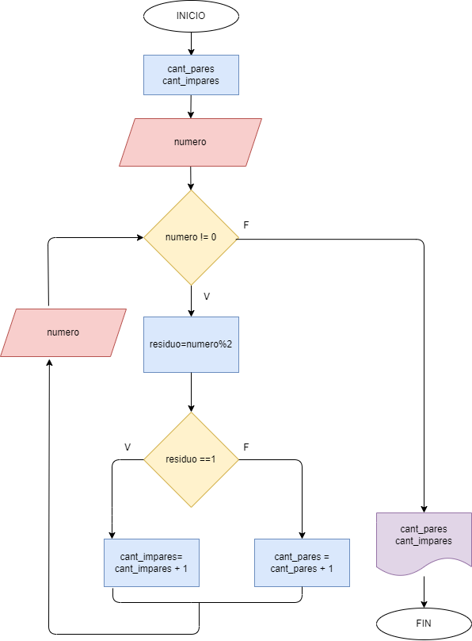

Hacer el diagrama de flujo y programa en Python que lea numeros entereos y positivos(1 en cada lectura) y averigue cuantos son pares y cuantos son impares. Para terminar usaremos el registro centinela cuando el valor del numero leido sea cero.

## Diagrama de flujo

